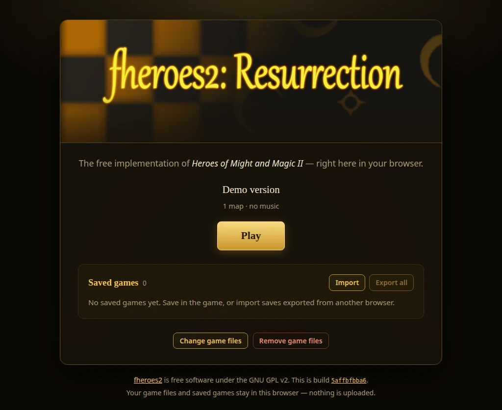

# fheroes2-web

**Play it in your browser: <https://kvth.github.io/fheroes2-web/>**

[](https://kvth.github.io/fheroes2-web/)

## Features

Compared to the standard launcher of the fheroes2 web version:

* **Free demo:** no copy of the game? Download the official demo from the start page and load it with one more click.
* **Easier setup:** pick your Heroes II folder or a zip of it. Works without the Price of Loyalty expansion too.
* **See what is installed:** the start page shows your game version, the number of maps and whether music is there.
* **Saved games on the start page:** see all your saves, delete the ones you no longer need.
* **Export and import saves:** download all saves as one zip file, for a backup or to continue on another
  browser or computer, and import them there.
* **Quit returns to the start page:** quitting the game brings you back, ready to play again.
* **Change or remove the game files** at any time, your saved games are kept.
* **Loading progress** while the game downloads.
* **New look:** a redesigned start page in the style of the game, which also works on small screens.

## Building

Helper scripts to build official [fheroes2](https://github.com/ihhub/fheroes2) with its built-in Emscripten
(WebAssembly) support, using podman, and host it via GitHub Pages. Only podman and git are needed on the host.

```sh
./build.sh                   # the pinned default commit (5affbfbba6bcc38eedbfa91cc0e4494cda2c3eb3)
./build.sh -r master         # latest commit of master
./build.sh -r 1.1.17         # a tag
./build.sh -r some-branch    # a branch
./build.sh -r <40-char-hash> # a specific commit
./build.sh --help            # all options
```

The ref is resolved to a commit hash before building, so a new commit on a branch always triggers a rebuild,
while rebuilding the same commit is served from the podman cache.
Upstream Emscripten support (`Makefile.emscripten`) exists since release 1.1.6, older refs cannot be built.

The result replaces the contents of `docs/` (override with `-o DIR`): the launcher (`index.html`, `assets/`),
`fheroes2.{js,wasm,data}`, license, readme and a `COMMIT` file with the built commit hash.

## Hosting

**GitHub Pages:** commit and push `docs/`, then in the repository settings under *Pages* choose
*Deploy from a branch*, branch `main`, folder `/docs`.

**Locally:**

```sh
./serve.sh              # http://127.0.0.1:8888/, or: ./serve.sh 0.0.0.0 8080
```

## Launcher

Instead of upstream's stock launcher, the build uses its own one from [web/](web) (Vue + TypeScript + Vite,
type-checked and built in a Node container as part of the podman build). It talks to the engine only through
what the Emscripten build exposes (`Module.canvas`, `Module.preRun`, `Module.setStatus` and the `FS`/`ENV`
globals), see [web/src/lib/engine.ts](web/src/lib/engine.ts).

* **Game files:** the original game data is not included. Select your Heroes of Might and Magic II folder
  (it must contain `DATA/HEROES2.AGG`; `MAPS`, `MUSIC` and `ANIM` are copied too) or a zip of it.
  Without the game, download the free demo `h2demo.zip` via the link (the browser version of upstream's
  `script/demo` scripts; archive.org does not allow downloading it from the page directly) and load it.
* **Saved games** are listed on the launcher, can be deleted, exported as `fheroes2-saves-<date>.zip` and
  imported from such zip files or single `.sav`, `.savc`, `.savh` and `.savm` files.

Game files and saves are stored in the browser (IndexedDB), nothing is uploaded. Quitting the game
returns to the launcher.

To work on the launcher with live reload against an existing build in `docs/` (no Node needed on the host):

```sh
podman run --rm -it --userns=keep-id -v ./web:/web:Z -v ./docs:/docs:ro,Z -w /web -p 5173:5173 \
    -e FHEROES2_BUILD_DIR=/docs docker.io/library/node:24-alpine sh -c 'npm ci && npm run dev -- --host'
```

## Multithreading

Multithreaded builds (`-t`) need the following headers, which GitHub Pages and `serve.sh` do not send,
so use the default single-threaded build there:

```text
Cross-Origin-Opener-Policy: same-origin
Cross-Origin-Embedder-Policy: require-corp
```
